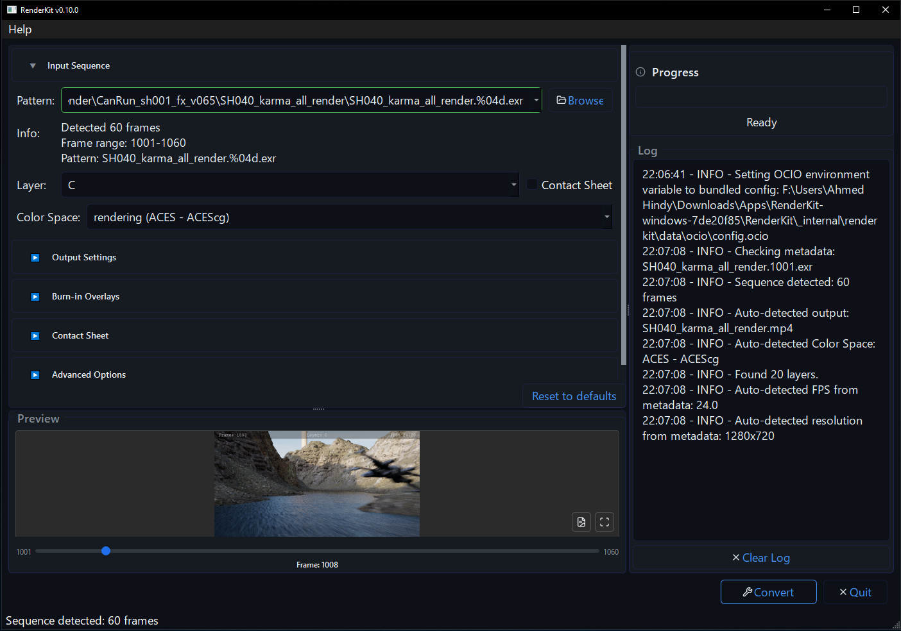

# RenderKit

[](https://opensource.org/licenses/MIT)
[](https://Ahmed-Hindy.github.io/renderkit/)

RenderKit is a desktop app for turning render image sequences into reviewable MP4s.
Open a sequence, choose the review settings you need, and click **Convert**.



_RenderKit converting an image sequence to MP4._

## Get The App

1. Download the latest RenderKit archive from GitHub Releases.
2. Unzip it.
3. Run the RenderKit executable.

On Windows, this is usually:

```powershell
RenderKit\RenderKit.exe
```

## Basic Workflow

1. Open RenderKit.
2. Drop a file or folder into the window or click **Browse**.
3. Check the detected sequence, frame range, FPS, and output path.
4. Choose a layer, contact sheet, burn-ins, or quality settings only if you need them.
5. Click **Convert**.

When the render finishes, use **Play Result** or **Open Output Folder**.

## What It Can Make

- MP4 movies from rendered image sequences.
- Supports both Single-layer EXRs and Multi-Layer contact sheets.
- Add burnins with frame, layer, or FPS.
- H.264, H.265, or AV1 outputs.

## More Documentation

For command-line, automation, environment-variable, source checkout, and Python API usage, see the [full documentation](https://Ahmed-Hindy.github.io/renderkit/).
